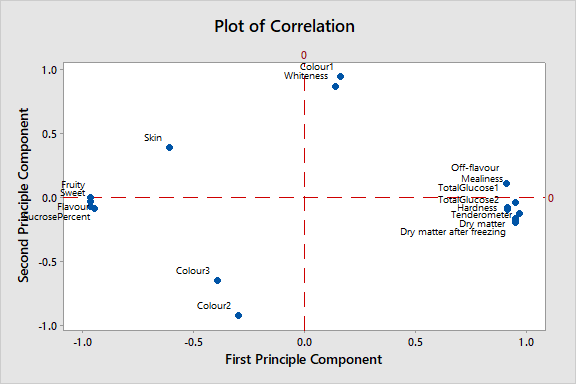
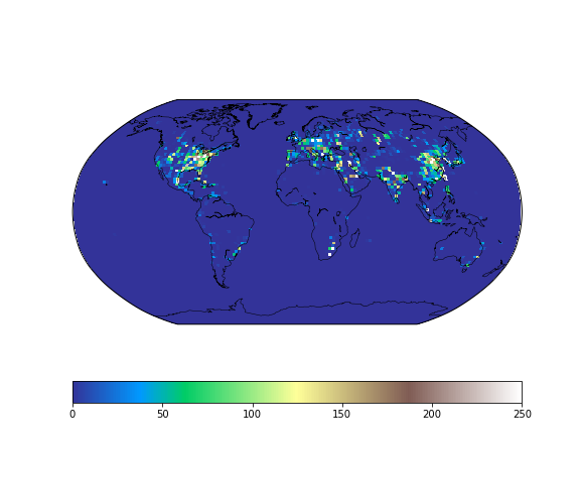
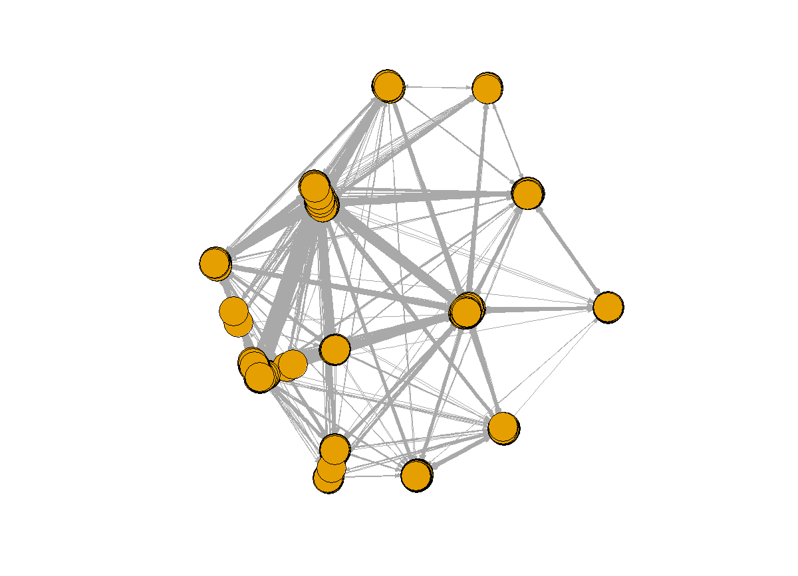
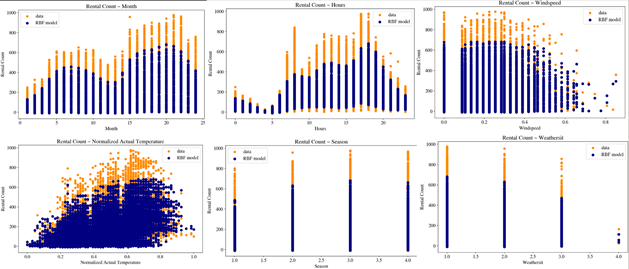

### Greetings

  

      <ul class="nav">
          <li><a href="{{ BASE_PATH }}/assets/Jane_v3.pdf">Resume (Updated Oct, 2018)</a></li>
          <!--<li><a href="https://mingyuhuiliu.github.io/">Github</a></li>-->
        <li><a href="https://www.linkedin.com/in/mingyuhuiliu/">LinkedIn</a></li>
      </ul>
  

As the top of the class in Data Analytics program at GWU and the VP of GWU Consulting Club, Mingyuhui Liu (Jane)'s main interest lies in using her data analytical skills to succeed in financial services. She will join the Pacific Investment Management Company ([PIMCO](https://www.pimco.com/en-us)) in 2019 as a full-time Technology Analyst in Newport Beach office, CA. 

Jane is a second-year MS candidate in Data Analytics in GWU. She is also holding a Master's Degree in Environmental Management from Duke University, and a Bachelor's degree in Mechanical Engineering from Xi'an Jiaotong University, Xi'an, China. 

For more information, please click [here](https://mingyuhuiliu.github.io/pages/about.html) to go to "Intro" for a quick walk-down bullet points.

During her leisure time, Jane loves traveling, filming and Soccer. Click [here](https://mingyuhuiliu.github.io/pages/lifestyle.html) to see more about her traveling, volunteering and Soccer-Loving photos and stories!

### Portfolio: Skills/Tools Examples

<table class="narrow">
<tr>
  <td class="left">
    
  </td>
  <td class="right">
    
  </td>
</tr>
<tr>
  <td class="left">
    
  </td>
  <td class="right">
    
  </td>
</tr>
</table>

  

      <ul class="nav">
          <li><a href="morefigs.html">see more figures</a></li>
      </ul>
  

### Contact Me
Email: janeliu@gwmail.gwu.edu
