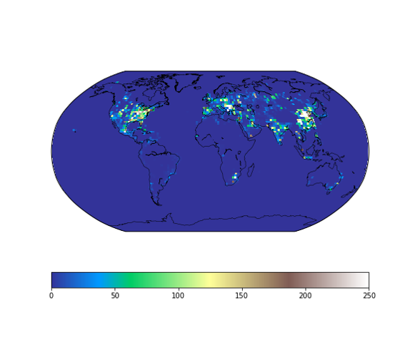
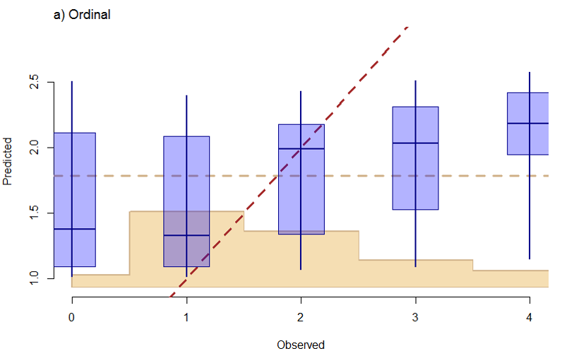

#### 1.King County House Price Prediction: A Support Vector Machine Approach
 &nbsp; &nbsp; &nbsp; In-progress Python (Updated on 11/26/2017): 
[ Python ]({{ BASE_PATH }}/assets/MP.pdf)

&nbsp; &nbsp; &nbsp; Scatter Matrix for Main Variables
 
&nbsp; &nbsp; &nbsp; 

&nbsp; &nbsp; &nbsp; Clustering based on Year
 

#### 2.Master Project: Comparison of Global Emission Inventories: Using Examples from US and China
 &nbsp; &nbsp; &nbsp; Download presentation:
[Symposium ]({{ BASE_PATH }}/assets/MP.pdf)

 &nbsp; &nbsp; &nbsp; EDGAR Dataset Energy Sector SO2 Emission Estimation, Summer 2000: 
&nbsp; &nbsp; &nbsp; Unit: kton/yr
 

 &nbsp; &nbsp; &nbsp; ECLIPSE Dataset Energy Sector SO2 Emission Estimation, Summer 2000: 
&nbsp; &nbsp; &nbsp; Unit: kton/yr
 
&nbsp; &nbsp; &nbsp; 

#### 3.Socio-economic and Environmental Consciousness Effects on Pro-environmental Attitudes
 &nbsp; &nbsp; &nbsp; Download R file:
[Sample Codes ]({{ BASE_PATH }}/assets/GSSData.R)
&nbsp; &nbsp; &nbsp; 

 &nbsp; &nbsp; &nbsp; Observed WTP Vs Predicted WTP in Generalized Joint Attribute Model (GJAM):
 

 &nbsp; &nbsp; &nbsp; GJAM Sensitivities:
 

 &nbsp; &nbsp; &nbsp; 95% Posteriors Sample: Cohort
 
---
