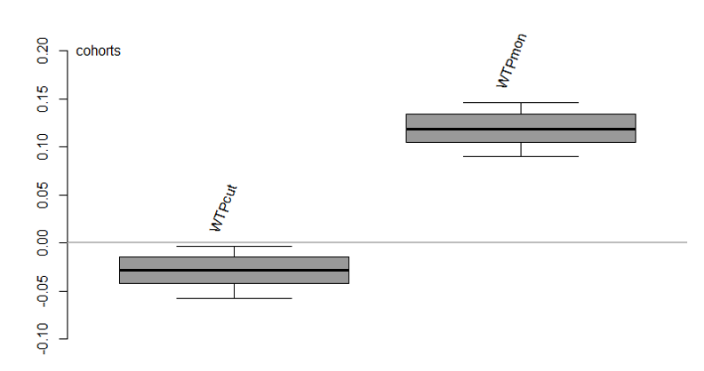

    

        <ul class="nav">
            <li><a href="#capitalbikeshare"><u>Business Intelligence</u></a></li>
            <li><a href="#kingcounty"><u>Price Prediction</u></a></li>
            <li><a href="#statistical"><u>Statistical Modeling: PCA & Regression</u></a></li>
            <li><a href="#master"><u>Master's Project</u></a></li>
            <li><a href="#R"><u>R Project</u></a></li>
        </ul>
    

---

### 2017.08-2017.12: Business Intelligence: Capital Bikeshare Profit Growth
 &nbsp; &nbsp; &nbsp; Download: 
[Download the Presentation](Final_Jane.pdf)

 &nbsp; &nbsp; &nbsp; Python (Updated on 12/7/2017): 
[ Python Final](Final_Project_CapitalBike.ipynb)

 &nbsp; &nbsp; &nbsp; Python Code Preview in Github:
[Python](https://github.com/MingyuhuiLiu/MingyuhuiLiu.github.io/blob/master/pages/Final_Project_HouseSale.ipynb)

 &nbsp; &nbsp; &nbsp; Model Visualization: Predicted Vs Test
&nbsp; &nbsp; &nbsp;  
&nbsp; &nbsp; &nbsp;

---

### 2017.08-2017.12: King County House Price Prediction: A Support Vector Machine Approach
 &nbsp; &nbsp; &nbsp; Python (Updated on 12/7/2017): 
[ Python ](Final_Project_HouseSale.ipynb)

&nbsp; &nbsp; &nbsp; Scatter Matrix for Main Variables
&nbsp; &nbsp; &nbsp; 
&nbsp; &nbsp; &nbsp; 

&nbsp; &nbsp; &nbsp; Clustering based on Year
 
---

### Statistical Modeling
#### Principle Component Analysis
 &nbsp; &nbsp; &nbsp; The spreadsheet "JudgeResultsPeas"
contains average response results on 17
attributes of 60 pea variations. Write a
detailed analysis report as if you are
conducting the analysis for a client and
detail your analysis steps for this client.
Analyze the pea attribute data using
principal components.

Decide on the number of principal components to retain and why, and interprete
the components. Decide if an increasing value of a pea attribute means "a pea" is
judged better or worse in terms of that attribute and next design a "pea metric"
using your pea attribute analysis, fit an appropriate theoretical distribution to the
score results of your "pea metric" and select using your fitted distribution the top
ten percent of peas that outperform the others.
 &nbsp; &nbsp; &nbsp;[Download the Excel](Excel_PCA.xlsx)
 &nbsp; &nbsp; &nbsp;[Download the Report](PCA.pdf)
 &nbsp; &nbsp; &nbsp; Scree Plot and Loading Plot from MiniTab.
&nbsp; &nbsp; &nbsp;  
&nbsp; &nbsp; &nbsp;  
&nbsp; &nbsp; &nbsp;

#### Regression
 &nbsp; &nbsp; &nbsp;[Download the Excel](Excel_Regression.xlsx)
 &nbsp; &nbsp; &nbsp;[Download the Report](Regression.pdf)

---

#### 2016.08-2017.05: Comparison of Global Emission Inventories: Using Examples from US and China
 &nbsp; &nbsp; &nbsp; Download presentation:
[Symposium ]({{ BASE_PATH }}/assets/MP.pdf)

 &nbsp; &nbsp; &nbsp; EDGAR Dataset Energy Sector SO2 Emission Estimation, Summer 2000: 
&nbsp; &nbsp; &nbsp; Unit: kton/yr
&nbsp; &nbsp; &nbsp; 

 &nbsp; &nbsp; &nbsp; ECLIPSE Dataset Energy Sector SO2 Emission Estimation, Summer 2000: 
&nbsp; &nbsp; &nbsp; Unit: kton/yr
&nbsp; &nbsp; &nbsp; 
&nbsp; &nbsp; &nbsp; 

---

#### 2017.02-2017.05: Socio-economic and Environmental Consciousness Effects on Pro-environmental Attitudes
 &nbsp; &nbsp; &nbsp; Download R file:
[Sample Codes ]({{ BASE_PATH }}/assets/GSSData.R)
&nbsp; &nbsp; &nbsp; 

 &nbsp; &nbsp; &nbsp; Observed WTP Vs Predicted WTP in Generalized Joint Attribute Model (GJAM):
&nbsp; &nbsp; &nbsp; 

 &nbsp; &nbsp; &nbsp; GJAM Sensitivities:
&nbsp; &nbsp; &nbsp; 

 &nbsp; &nbsp; &nbsp; 95% Posteriors Sample: Cohort
&nbsp; &nbsp; &nbsp;  
---
