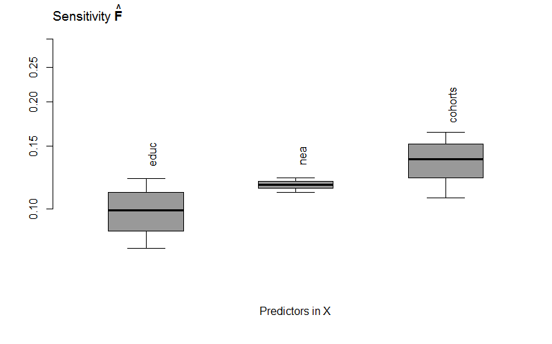

    

        <ul class="nav">
            <li><a href="#Capstone"><u>Capstone: Twitter sentiment predict stock price changes</u></a></li>
            <li><a href="#Bank-Campaign"><u>Bank Campaign Prediction</u></a></li>
            <li><a href="#capitalbikeshare"><u>Business Intelligence</u></a></li>
            <li><a href="#kingcounty"><u>Price Prediction</u></a></li>
            <li><a href="#statistical"><u>Statistical Modeling: PCA & Regression</u></a></li>
            <!--<<li><a href="#MTurk"><u>Crowd Sourcing Project: Used Car Prices</u></a></li>
            <li><a href="#master"><u>Master's Project</u></a></li>
            <li><a href="#R"><u>R Project</u></a></li> -->
        </ul>
    

---

### Capstone Project: Twitter sentiments to predict stock price changes, 2018.10-2019.04
In light of the heating topic of whether public sentiment extracted from social media can predict stock market, this research proposed a predictive model on the stock market movement with public sentiment as an explanatory variable. 3 target companies were chosen and examined – Tesla, Microsoft and Netflix. In general, with 5-minutes’ intervals, the research proposed a model that outperforms the baseline Autoregression Regression Integrated Moving Average (ARIMA) model across target companies and across multiple days. 
 * Methodologies:  
 &nbsp;&nbsp; * Time series 
 &nbsp;&nbsp; * Regressions 
 &nbsp;&nbsp; * Sentiment analysis 
 <!--  &nbsp; &nbsp; &nbsp; Download: 
[Download the Presentation(pdf)](FinalPresentation.pptx) -->
  &nbsp; &nbsp; &nbsp; Download: 
[Download the Presentation(pdf)](FinalPresentation.pptx)
 &nbsp; &nbsp; &nbsp; Download: 
[Download the Python Codes](Github_Version.ipynb)
 &nbsp; &nbsp; &nbsp; Microsoft Full Model Predictions Vs True Price Changes: 
&nbsp; &nbsp; &nbsp; 
 &nbsp; &nbsp; &nbsp; Tesla Full Model Predictions Vs True Price Changes: 
&nbsp; &nbsp; &nbsp; 
 &nbsp; &nbsp; &nbsp; Netflix Full Model Predictions Vs True Price Changes: 
&nbsp; &nbsp; &nbsp; 
---

### Campaign for Deposit Subscription: Feature Selection and Prediction, 2018.02-2018.05
Banks campaign to persuade customers to make term deposits. This project takes in a dataset regarding a bank campaign and predicts term deposit status. The anticipated outcome is that user can put in the customer and campaign related data, and then get a prediction of whether the customer will make a term deposit, so that the banker will get some insight of what strategy he or she should use during the campaign process with this customer. 
 * Methodologies:  
 &nbsp;&nbsp; * SQL 
 &nbsp;&nbsp; * Handling categorical variables 
 &nbsp;&nbsp; * PCA 
 &nbsp;&nbsp; * SVC, Logistic, Random Forest and Naïve Bayes. 
 &nbsp;&nbsp; * Recall, Precision, F2 score, ROC, etc. 
  &nbsp; &nbsp; &nbsp; Download: 
[Download the Presentation(pdf)](Final_Presentation_Mingyuhui_Liu_(Jane).pdf)
 &nbsp; &nbsp; &nbsp; Download: 
[Download the Python Codes](FinalProject_BankMarketing_Mingyuhui_Liu_(Jane).ipynb)

---
### Business Intelligence: Capital Bikeshare Profit Growth, 2017.08-2017.12
 &nbsp; &nbsp; &nbsp; Download: 
[Download the Presentation](Final_Jane.pdf)

 &nbsp; &nbsp; &nbsp; Python (Updated on 12/7/2017): 
[ Python Final](Final_Project_CapitalBike.ipynb)

 &nbsp; &nbsp; &nbsp; Python Code Preview in Github:
[Python](https://github.com/MingyuhuiLiu/MingyuhuiLiu.github.io/blob/master/pages/Final_Project_HouseSale.ipynb)

 &nbsp; &nbsp; &nbsp; Model Visualization: Predicted Vs Test
&nbsp; &nbsp; &nbsp;  
&nbsp; &nbsp; &nbsp;

---

### King County House Price Prediction: A Support Vector Machine Approach, 2017.08-2017.12
 &nbsp; &nbsp; &nbsp; Python (Updated on 12/7/2017): 
[ Python ](Final_Project_HouseSale.ipynb)

&nbsp; &nbsp; &nbsp; Scatter Matrix for Main Variables
&nbsp; &nbsp; &nbsp; 
&nbsp; &nbsp; &nbsp; 

&nbsp; &nbsp; &nbsp; Clustering based on Year
 
---

### Statistical Modeling
#### Principle Component Analysis, 2017.08-2017.12
 &nbsp; &nbsp; &nbsp; The spreadsheet "JudgeResultsPeas"
contains average response results on 17
attributes of 60 pea variations. Write a
detailed analysis report as if you are
conducting the analysis for a client and
detail your analysis steps for this client.
Analyze the pea attribute data using
principal components.

Decide on the number of principal components to retain and why, and interprete
the components. Decide if an increasing value of a pea attribute means "a pea" is
judged better or worse in terms of that attribute and next design a "pea metric"
using your pea attribute analysis, fit an appropriate theoretical distribution to the
score results of your "pea metric" and select using your fitted distribution the top
ten percent of peas that outperform the others.
 &nbsp; &nbsp; &nbsp;[Download the Excel](Excel_PCA.xlsx)
 &nbsp; &nbsp; &nbsp;[Download the Report](PCA.pdf)

 

Scree Plot and Loading Plot from MiniTab.
&nbsp; &nbsp; &nbsp;  
&nbsp; &nbsp; &nbsp;  

 

#### Regression, 2017.08-2017.12
 &nbsp; &nbsp; &nbsp;[Download the Excel](Excel_Regression.xlsx)
 &nbsp; &nbsp; &nbsp;[Download the Report](Regression.pdf)

---
<!--
### Crowd Sourcing Project: MTurk on Used Car Prices
 &nbsp; &nbsp; &nbsp; WorkerSandbox: Search for "Mingyuhui Liu".
[Sign In To View the Crowd Sourcing MTurk](http://workersandbox.mturk.com)

 &nbsp; &nbsp; &nbsp; MTurk Instruction Sample Table:
&nbsp; &nbsp; &nbsp;  

&nbsp; &nbsp; &nbsp;

---

### Comparison of Global Emission Inventories: Using Examples from US and China, 2016.08-2017.05
 &nbsp; &nbsp; &nbsp; Download presentation:
[Symposium ]({{ BASE_PATH }}/assets/MP.pdf)

 &nbsp; &nbsp; &nbsp; EDGAR Dataset Energy Sector SO2 Emission Estimation, Summer 2000: 
&nbsp; &nbsp; &nbsp; Unit: kton/yr
&nbsp; &nbsp; &nbsp; 

 &nbsp; &nbsp; &nbsp; ECLIPSE Dataset Energy Sector SO2 Emission Estimation, Summer 2000: 
&nbsp; &nbsp; &nbsp; Unit: kton/yr
&nbsp; &nbsp; &nbsp; 
&nbsp; &nbsp; &nbsp; 

---

### Socio-economic and Environmental Consciousness Effects on Pro-environmental Attitudes, 2017.02-2017.05
 &nbsp; &nbsp; &nbsp; Download R file:
[Sample Codes ]({{ BASE_PATH }}/assets/GSSData.R)
&nbsp; &nbsp; &nbsp; 

 &nbsp; &nbsp; &nbsp; Observed WTP Vs Predicted WTP in Generalized Joint Attribute Model (GJAM):
&nbsp; &nbsp; &nbsp; 

 &nbsp; &nbsp; &nbsp; GJAM Sensitivities:
&nbsp; &nbsp; &nbsp; 

 &nbsp; &nbsp; &nbsp; 95% Posteriors Sample: Cohort
&nbsp; &nbsp; &nbsp;   -->
---

